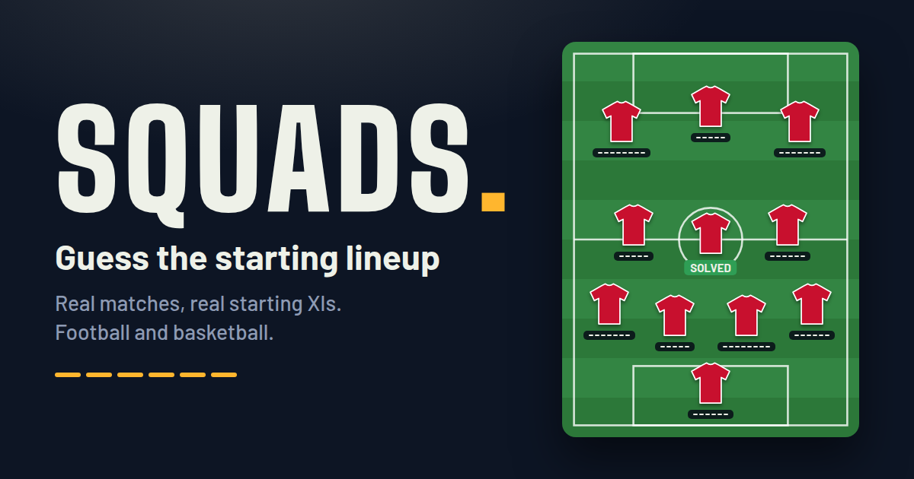

# Squads

Guess the starting lineup of real football and basketball matches.

**Play:** [guessthesquad.com](https://www.guessthesquad.com)



## How it works

Each puzzle is one real match: the teams, the score, the competition and the season. The pitch (or court) shows the starting lineup as shirts with nationality flags. Tap a shirt and type the name the player is known by, usually the surname. Each dash is one letter.

- Letters turn green in the right spot, gold when they are in the name but elsewhere, and grey when they are not in it.
- 6 tries per player. **Hard** mode gives 4 tries and hides the flags.
- **Daily** gives everyone the same lineup for the day. Stats stay in your browser.

The lineups cover football from 2009 (club competitions, domestic leagues, national teams) and basketball from 2012 (NBA, Serbia's national team and clubs, EuroLeague 2019–2025), 827 matches in all.

## Run it locally

The site is static and the build needs only Python 3.

```sh
python3 build.py              # checks data/*.json and writes index.html + data.<hash>.json
python3 -m http.server 8000   # then open http://localhost:8000
```

## Repository layout

| Path | What it is |
|---|---|
| `src.html` | The game: markup, styles and script. The build injects the data. |
| `data/*.json` | Lineups, one file per scope (competition or region). |
| `SPEC.md` | Data format and quality rules for lineups. |
| `validate.py` | Checks a data file against the spec: `python3 validate.py data/f01_ucl.json` |
| `build.py` | Merges and checks all data, then writes the site (`index.html`, `data.<hash>.json`). |
| `flags/` | Nationality flags as SVG. |
| `tools/` | Optional helpers: EuroLeague lineups from the official feed (`gen_euroleague.py`, needs `pycountry`) and the share image and icons (`make_images.mjs`, needs Playwright). |
| `MAINTAINING.md` | Notes for maintainers: deployment, data status and sources. |
| `.github/` | The pull request check, issue forms and the ruleset for `main`. |

The built files (`index.html`, `data.<hash>.json`) are committed, so any static host can serve the repository root with no build step. The live site is on Vercel.

## Contributing

Lineup fixes and new matches are welcome. Report a wrong lineup with the issue form, or follow [CONTRIBUTING.md](CONTRIBUTING.md) to change the data yourself. Every pull request is checked automatically: each data file must pass `validate.py`, and the committed site must match a fresh build. Security issues go through [SECURITY.md](SECURITY.md).

## Sources and credits

- Lineups were checked against public match reports and box scores, [StatsBomb Open Data](https://github.com/statsbomb/open-data), a community mirror of Transfermarkt match data, and the official EuroLeague game feed.
- Flags come from [flagcdn](https://flagcdn.com) and [flag-icons](https://github.com/lipis/flag-icons) (MIT).
- The typeface is [Archivo](https://fonts.google.com/specimen/Archivo) (SIL Open Font License).

Squads is a fan project and is not affiliated with any club, league or competition. Team and player names identify the matches, and kit colours are approximations.

## License

The code is released under the [MIT License](LICENSE). The lineup data in `data/` is compiled from the public sources listed above; StatsBomb Open Data keeps its own terms, which ask for attribution.
